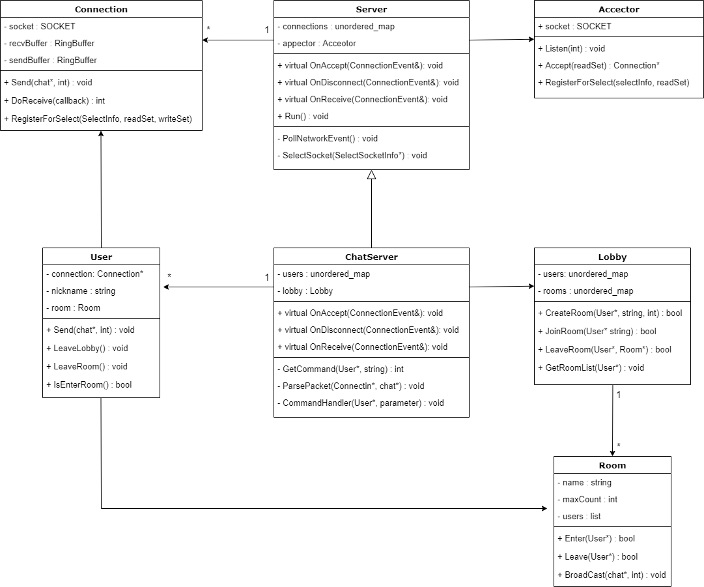

# SelectChatServer

## 개요
* select 모델을 사용하여 개발한 간단한 채팅서버 프로그램
* 텔넷 클라이언트 사용

## 개발환경
* OS : Windows 11
* Visual Studio 2022, C++ 사용

## 네트워크 레이어
* Server : 기본 서버 객체
* Connection : SOCKET을 래핑하여 네트워크 송수신 지원
* Acceptor : 연결 수락

## 콘텐츠 레이어
* ChatServer : Server 객체를 상속받아 로직 작성, 패킷 핸들러 처리
* User : Connection을 포함하여 사용
* Lobby : 방 생성, 참여 등 방 관리 및 로비 기본 기능 구현
* Room : 방을 담당하며 채팅기능 지원
